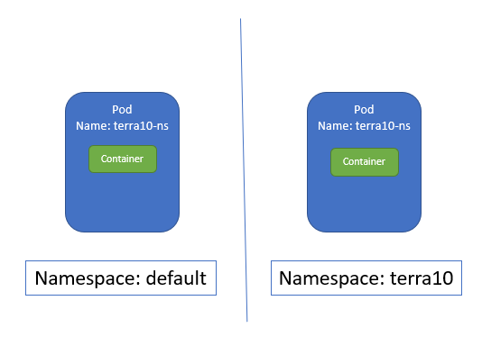

# 6. Kubernetes Namespaces: even more organisation

In Lab 5, Labels were used to organise the Kubernetes resources/objects. We attached labels to Pods and demonstrated that the Labels helped to group the Pods.

**Kubernetes Namespace**
In this Lab, Kubernetes Namespaces are introduced. A Kubernetes Namespace is different from the namespace in Linux. The Kubernetes Namespace is used to scope the visibility of Kubernetes Objects. Simply put: a Kubernetes Object is only visible in one single Namespace.

**default Namespace**
So far, in all our kubectl commands, we have never mentioned a Namespace. Reason is that so far, we only used the Namespace ***default***, which is the default for the kubectl commands.

**Usage**
You can use Kubernetes Namespaces e.g. to split a large, complex cluster into smaller distinct groups of Objects. Or to split a Kubernetes cluster into a multi-tenant environment where all tenants have their own Namespace.

**What we will do**
In this lab we will create a new namespace named `terra10`. Then, we will start in the new namespace a copy of a Pod that already runs in the namespace `default` (under the same name). The configuration that we will establish is:



## 6.1 Other Namespaces and being curious
Before getting on with the exercises, we first examine what namespaces are already present on your Kubernetes cluster:
```bash
developer@developer-VirtualBox:~/projects/k4d/lab 6$ k get namespaces 
NAME          STATUS    AGE
default       Active    2d
kube-public   Active    2d
kube-system   Active    2d
developer@developer-VirtualBox:~/projects/k4d/lab 6$ 
```
These namespaces are (from the Kubernetes reference documentation):
- **default** - the default namespace for objects with no other namespace
- **kube-system** - the namespace for objects created by the Kubernetes system
- **kube-public** - this namespace is created automatically and is readable by all users (including those not authenticated). This namespace is mostly reserved for cluster usage, in case that some resources should be visible and readable publicly throughout the whole cluster. The public aspect of this namespace is only a convention, not a requirementdefault.

Well, the above description does shed some light on the namespaces purposes, but inquiring minds want to have a closer peek... at what Pods are running in namespace `kube-public`  and `kube-system`:
```bash
developer@developer-VirtualBox:~/projects/k4d/lab 6$ k get pod -n kube-system
NAME                                    READY     STATUS    RESTARTS   AGE
etcd-minikube                           1/1       Running   8          2d
kube-addon-manager-minikube             1/1       Running   61         2d
kube-apiserver-minikube                 1/1       Running   8          2d
kube-controller-manager-minikube        1/1       Running   8          2d
kube-dns-86f4d74b45-gkfkm               3/3       Running   30         2d
kube-proxy-gj2lj                        1/1       Running   8          2d
kube-scheduler-minikube                 1/1       Running   8          2d
kubernetes-dashboard-5498ccf677-cvrpk   1/1       Running   18         2d
storage-provisioner                     1/1       Running   18         2d
developer@developer-VirtualBox:~/projects/k4d/lab 6$
```
and
```bash
developer@developer-VirtualBox:~/projects/k4d/lab 6$ k get pod -n kube-public
No resources found.
developer@developer-VirtualBox:~/projects/k4d/lab 6$
```
So the `kube-system` namespace has a lot of system related Pods in it. Nicely separated from the rest.
And the `kube-public` namespace has no Pods as ... we didn't put anything in it.

## 6.2 Creating namespace `terra10`

The lab 6 directory has a file named `terra10-namespace.yaml` that can be used to create the `terra10` namespace. The file is:
```bash
apiVersion: v1
kind: Namespace                # Type of object is namespace
metadata:
  name: terra10-namespace      # Name of object is terra10-namespace
```
Running the command should be familiar by now:
```bash
developer@developer-VirtualBox:~/projects/k4d/lab 6$ k create -f terra10-namespace.yaml 
namespace/terra10-namespace created
developer@developer-VirtualBox:~/projects/k4d/lab 6$ 
```
Verifying that the namespace is created:
```bash
developer@developer-VirtualBox:~/projects/k4d/lab 6$ k get namespaces 
NAME                STATUS    AGE
default             Active    2d
kube-public         Active    2d
kube-system         Active    2d
terra10-namespace   Active    42s
developer@developer-VirtualBox:~/projects/k4d/lab 6$
```
Great. Now, check that there is already a Pod running in namespace `default` with name terra10-simple:
```bash
developer@developer-VirtualBox:~/projects/k4d/lab 6$ k get pod
NAME                    READY     STATUS    RESTARTS   AGE
terra10-gx6sr           1/1       Running   3          1d
terra10-playback-0340   1/1       Running   1          22h
terra10-playback-3542   1/1       Running   1          22h
terra10-playback-5674   1/1       Running   1          22h
terra10-qjdqv           1/1       Running   3          1d
terra10-record-2874     1/1       Running   1          22h
terra10-record-3899     1/1       Running   1          22h
terra10-record-4139     1/1       Running   1          22h
terra10-simple          1/1       Running   3          1d
terra10-z4lkv           1/1       Running   3          1d
developer@developer-VirtualBox:~/projects/k4d/lab 6$
```
Next step is to try and create a second Pod named terra10-simple in the namespace `default` (the yaml manifest is also in the lab 6 directory):
```bash
developer@developer-VirtualBox:~/projects/k4d/lab 6$ more terra10-simple.yaml 
apiVersion: v1
kind: Pod
metadata:
  name: terra10-simple
spec:
  containers:
  - image: lgorissen/terra10
    name: terra10
    ports:
    - containerPort: 8080
      protocol: TCP
developer@developer-VirtualBox:~/projects/k4d/lab 6$ k create -f terra10-simple.yaml 
Error from server (AlreadyExists): error when creating "terra10-simple.yaml": pods "terra10-simple" already exists
developer@developer-VirtualBox:~/projects/k4d/lab 6$
```
Which is what we expected. Now, create the terra10-simple Pod in the `terra10` namespace:
```bash
developer@developer-VirtualBox:~/projects/k4d/lab 6$ k create -f terra10-simple.yaml -n terra10-namespace
pod/terra10-simple created
developer@developer-VirtualBox:~/projects/k4d/lab 6$ k get pod -n terra10-namespace 
NAME             READY     STATUS    RESTARTS   AGE
terra10-simple   1/1       Running   0          8s
developer@developer-VirtualBox:~/projects/k4d/lab 6$
```

