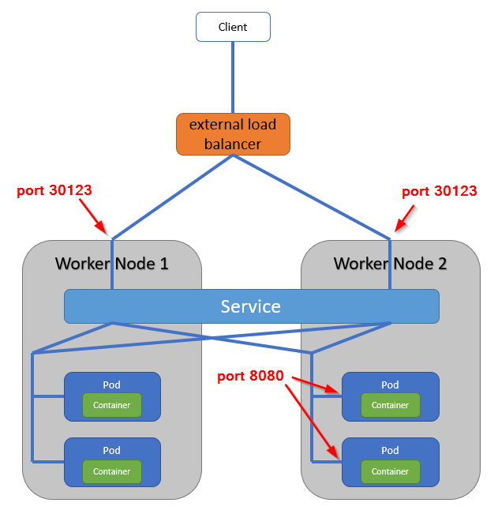
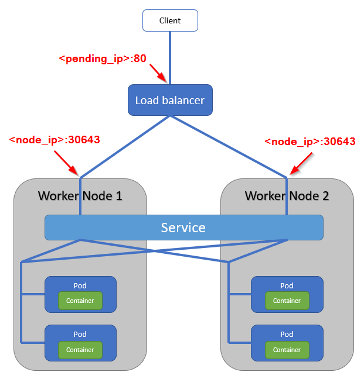
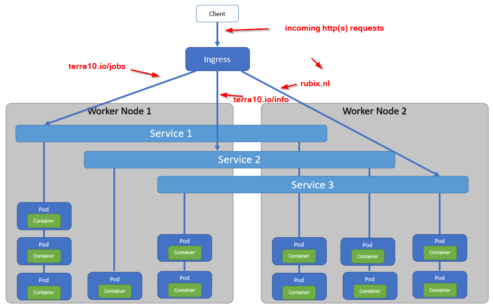

# 14. Expose your ... Pod

Already in Lab 2 we used a Service to expose the Pod to the outside world. We need a Service because directly exposing Pods to clients is not a good idea:


In the above figure, we see a ReplicationController that controls a set of Pods. The benefits are clear: the ReplicationController starts/stops Pods as many as needed. And when a Pod crashes, the ReplicationController starts a new Pod somewhere in the Kubernetes Cluster. For clients, this leads to the following problems:

- traffic must be routed - load balanced - over multiple destinations (Pods)
- these destinations IP address are not known beforehand: Pods get their IP address upon creation
- at any moment, a Pod may disappear or be created

The Service will hide all this Pod and ReplicationController behavior and provide one single access point to clients.

Time for hands-on.

## A simple Service

In this lab, we'll make a simple service that accesses some containers - just like we did in lab 2. However, there we used `kubectl` commands to achieve the configuration. Here, we will use manifest files (all in the `lab 14` directory) for the ReplicationController and the Service.

The ReplicationController is the one from lab 9, so it doesn't need much introduction:

```bash
apiVersion: v1
kind: ReplicationController       # type of resource
metadata:
  name: terra10-rc                # name
spec:
  replicas: 3                     # desired number of Pods
  selector:
    app: terra10                  # Label Selector for counting Pods
  template:                       # Pod specification starts here
    metadata:
      labels:                     # Pod labels
        app: terra10              # the label that is also used in the Label Selector
    spec:                         # start of Container specification
      containers:
      - name: terra10
        image: lgorissen/terra10
        ports:
        - containerPort: 8080
```

The manifest file for the Service:

```bash
apiVersion: v1
kind: Service         # type of resource
metadata:
  name: terra10       # name of Service
spec:
  ports:
  - port: 80          # external port, i.e. port for client access
    targetPort: 8080  # Pod (container) port that the Service forwards to
  selector:
    app: terra10      # Label select: selects all Pods with label 'app=terra10'
```

First, fire up the Replication Controller:

```bash
developer@developer-VirtualBox:~/projects/k4d/lab 14$ kubectl create -f terra10-rc.yaml 
replicationcontroller/terra10-rc created
developer@developer-VirtualBox:~/projects/k4d/lab 14$ kubectl get rc
NAME         DESIRED   CURRENT   READY     AGE
terra10-rc   3         3         3         7s
developer@developer-VirtualBox:~/projects/k4d/lab 14$
```

Next, create the Service:

```bash
developer@developer-VirtualBox:~/projects/k4d/lab 14$ kubectl create -f terra10-service.yaml 
service/terra10 created
developer@developer-VirtualBox:~/projects/k4d/lab 14$ kubectl get service
NAME         TYPE        CLUSTER-IP      EXTERNAL-IP   PORT(S)   AGE
kubernetes   ClusterIP   10.96.0.1       <none>        443/TCP   10d
terra10      ClusterIP   10.102.181.8    <none>        80/TCP    5s
developer@developer-VirtualBox:~/projects/k4d/lab 14$
```

Beware: the Service's **Cluster IP** is shown: the Service is accessible **from within the Kubernetes Cluster** on that IP address: 10.102.181.8!

If you are on a Cluster node (or the Node that you are running Minikube on), you can verify the correct operation of the Service using `curl`:

```bash
developer@developer-VirtualBox:~$ while true; do curl 10.102.181.8; sleep 5; done
Hello, you landed on Terra10 and host terra10-rc-67fmf welcomes you!
Hello, you landed on Terra10 and host terra10-rc-zkwt5 welcomes you!
Hello, you landed on Terra10 and host terra10-rc-zkwt5 welcomes you!
Hello, you landed on Terra10 and host terra10-rc-67fmf welcomes you!
Hello, you landed on Terra10 and host terra10-rc-zkwt5 welcomes you!
Hello, you landed on Terra10 and host terra10-rc-67fmf welcomes you!
Hello, you landed on Terra10 and host terra10-rc-5tmq6 welcomes you!
^C
developer@developer-VirtualBox:~$ 
```

Another option is to run the `curl` command from one of the Pods, using `kubectl exec`:

```bash
developer@developer-VirtualBox:~$ kubectl get pod
NAME               READY     STATUS    RESTARTS   AGE
terra10-rc-5tmq6   1/1       Running   2          13h
terra10-rc-67fmf   1/1       Running   2          13h
terra10-rc-zkwt5   1/1       Running   2          13h
developer@developer-VirtualBox:~$ kubectl exec terra10-rc-5tmq6 -- curl -s 10.102.181.8
Hello, you landed on Terra10 and host terra10-rc-zkwt5 welcomes you!
```
Note that the request is answered by a different Pod than the one that is sending the request: the Service selects a random Pod to send the request to.

Hmmmm .... now we only need to make our Pod externally accessible...

## A simple solution - a NodePort Service


```bash
apiVersion: v1
kind: Service            # resource type Service
metadata:
  name: terra10-nodeport
spec:
  type: NodePort         # set the Service type to NodePort
  ports:
  - port: 80             # port for client access (internal Cluster IP)
    targetPort: 8080     # Pod (container) port that the Service forwards to
    nodePort: 30123      # Port on each Node that the Service forwards to
  selector:
    app: terra10
```

The NodePort Service is illustrated with the figure below:



The external load balancer balances traffic over the Worker Nodes. Then, the NodePort Service balances the traffic over the Pods: also the Pods on the other Nodes. 

Let's see how this works:

```bash
developer@developer-VirtualBox:~/projects/k4d/lab 14$ kubectl create -f terra10-service-nodeport.yaml 
service/terra10-nodeport created
developer@developer-VirtualBox:~/projects/k4d/lab 14$ kubectl describe service terra10-nodeport 
Name:                     terra10-nodeport
Namespace:                default
Labels:                   <none>
Annotations:              <none>
Selector:                 app=terra10
Type:                     NodePort
IP:                       10.98.157.230
Port:                     <unset>  80/TCP
TargetPort:               8080/TCP
NodePort:                 <unset>  30123/TCP
Endpoints:                172.17.0.4:8080,172.17.0.5:8080,172.17.0.6:8080
Session Affinity:         None
External Traffic Policy:  Cluster
Events:                   <none>
developer@developer-VirtualBox:~/projects/k4d/lab 14$ 
```
Note in the above listing:
- the NodePort and TargetPort
- the NodePort Service also has an IP that can be used: 10.98.157.230:80 
- the Pods are listed under the Endpoints

So, now we should be able to access our service via the NodePort. First, look up the (internal) IP of the minikube Cluster Node and then hit it with curl:

```bash
developer@developer-VirtualBox:~/projects/k4d/lab 14$ kubectl cluster-info
Kubernetes master is running at https://10.0.2.15:8443
KubeDNS is running at https://10.0.2.15:8443/api/v1/namespaces/kube-system/services/kube-dns:dns/proxy

To further debug and diagnose cluster problems, use 'kubectl cluster-info dump'.
developer@developer-VirtualBox:~/projects/k4d/lab 14$ while true; do curl 10.0.2.15:30123; sleep 5; done
Hello, you landed on Terra10 and host terra10-rc-67fmf welcomes you!
Hello, you landed on Terra10 and host terra10-rc-67fmf welcomes you!
Hello, you landed on Terra10 and host terra10-rc-5tmq6 welcomes you!
Hello, you landed on Terra10 and host terra10-rc-67fmf welcomes you!
Hello, you landed on Terra10 and host terra10-rc-zkwt5 welcomes you!
^C
developer@developer-VirtualBox:~/projects/k4d/lab 14$ 
```
Works like a charm.


## Another solution - a LoadBalancer Service

In the NodePort solution, you have to arrange the Load Balancer functionality yourself - outside of the Kubernetes Cluster. However, most commercial Kubernetes cloud offerings include a Load Balancer infra component as part of the Kubernetes Cluster. In other words, the Load Balancer configuration is under control of Kubernetes. Then, a Service of type LoadBalancer can be used.

***Now, your local minikube installation does not have a LoadBalancer. So, just for training purpose we'll make the LoadBalancer Service and access it.***
 
```bash
developer@developer-VirtualBox:~/projects/k4d/lab 14$ kubectl create -f terra10-service-loadbalancer.yaml 
service/terra10-loadbalancer created
developer@developer-VirtualBox:~/projects/k4d/lab 14$ kubectl get service 
NAME                   TYPE           CLUSTER-IP      EXTERNAL-IP   PORT(S)        AGE
kubernetes             ClusterIP      10.96.0.1       <none>        443/TCP        11d
terra10                ClusterIP      10.102.181.8    <none>        80/TCP         1h
terra10-loadbalancer   LoadBalancer   10.107.96.23    <pending>     80:30643/TCP   6s
terra10-nodeport       NodePort       10.98.157.230   <none>        80:30123/TCP   1h
developer@developer-VirtualBox:~/projects/k4d/lab 14$
```
The accompanying figure is similar to that of the NodePort Service:



Because we are missing the LoadBalancer in minikube, there is no EXTERNAL-IP address shown :-(. So, access to the LoadBalancer service can be done via the Node address and the LoadBalancer CLUSTER-IP address:

```bash
developer@developer-VirtualBox:~/projects/k4d/lab 14$  curl -s http://10.0.2.15:30643
Hello, you landed on Terra10 and host terra10-rc-5tmq6 welcomes you!
developer@developer-VirtualBox:~/projects/k4d/lab 14$ curl http://10.107.96.23
Hello, you landed on Terra10 and host terra10-rc-zkwt5 welcomes you!
developer@developer-VirtualBox:~/projects/k4d/lab 14$ 
```
Nice.


## Yet another solution - an Ingress Service

By now you should have the feeling that the options that are presented in this lab are getting better and better. You are right. 
Kubernetes also offers the so-called Ingress Service, which is not an actual Service but is sits in front of the Service. The Ingress Service can do Layer 7 HTTP(S) load balancing: it routes based on host and path:



So, the Ingress Service does address some issues:
- a regular LoadBalancer Service requires an external IP address for each Service. Depending on your set-up, that can be both inconvenient and costly
- offers host and path based routing
- offers additional features like cookie based session affinity 

Just like with the LoadBalancer Service, the Ingress Service in your Kubernetes platform is only supported when your Kubernetes platform provider has implemented an **Ingress Controller**. 

**Minikube Ingress Controller add-on**

So, the question you have to ask now is whether Minikube has implemented an Ingress Controller. And luckily, it has implemented that as an add-on. First, check what add-ons are enabled in your set-up:

```bash
developer@developer-VirtualBox:~/projects/k4d/lab 14$ minikube addons list
- addon-manager: enabled
- coredns: disabled
- dashboard: enabled
- default-storageclass: enabled
- efk: disabled
- freshpod: disabled
- heapster: disabled
- ingress: disabled
- kube-dns: enabled
- metrics-server: disabled
- nvidia-driver-installer: disabled
- nvidia-gpu-device-plugin: disabled
- registry: disabled
- registry-creds: disabled
- storage-provisioner: enabled
developer@developer-VirtualBox:~/projects/k4d/lab 14$
````
Nondepie - the ingress add-on is disabled. Enable it:

```bash
developer@developer-VirtualBox:~/projects/k4d/lab 14$ sudo minikube addons enable ingress
ingress was successfully enabled
developer@developer-VirtualBox:~/projects/k4d/lab 14$ minikube addons list
- addon-manager: enabled
- coredns: disabled
- dashboard: enabled
- default-storageclass: enabled
- efk: disabled
- freshpod: disabled
- heapster: disabled
- ingress: enabled
- kube-dns: enabled
- metrics-server: disabled
- nvidia-driver-installer: disabled
- nvidia-gpu-device-plugin: disabled
- registry: disabled
- registry-creds: disabled
- storage-provisioner: enabled
developer@developer-VirtualBox:~/projects/k4d/lab 14$
```
Verify:
```bash
developer@developer-VirtualBox:~/projects/k4d/lab 14$ kubectl get pod --all-namespaces 
NAMESPACE     NAME                                        READY     STATUS              RESTARTS   AGE
default       terra10-rc-5tmq6                            1/1       Running             2          17h
default       terra10-rc-67fmf                            1/1       Running             2          17h
default       terra10-rc-zkwt5                            1/1       Running             2          17h
kube-system   default-http-backend-59868b7dd6-wvjvv       1/1       Running             0          1m
kube-system   etcd-minikube                               1/1       Running             20         11d
kube-system   kube-addon-manager-minikube                 1/1       Running             73         11d
kube-system   kube-apiserver-minikube                     1/1       Running             20         11d
kube-system   kube-controller-manager-minikube            1/1       Running             20         11d
kube-system   kube-dns-86f4d74b45-gkfkm                   3/3       Running             66         11d
kube-system   kube-proxy-gj2lj                            1/1       Running             20         11d
kube-system   kube-scheduler-minikube                     1/1       Running             20         11d
kube-system   kubernetes-dashboard-5498ccf677-cvrpk       1/1       Running             41         11d
kube-system   nginx-ingress-controller-5984b97644-msxjt   0/1       ContainerCreating   0          1m
kube-system   storage-provisioner                         1/1       Running             42         11d
developer@developer-VirtualBox:~/projects/k4d/lab 14$ 
```

And after a while, it will show STATUS Running.

**Create an Ingress Service**

Now, we're ready to create an Ingress Service.

Have a look at the manifest file:

```bash
apiVersion: extensions/v1beta1
kind: Ingress                            # Resource type Ingress
metadata:
  name: terra10-ingress                  # Ingress name
spec:
  rules:                                 # list of routing rules for incoming requests
  - host: terra10.io                     # routing for host 'terra10.io'
    http:
      paths:                             # list of routing paths
      - path: /landing                   # path /landing
        backend:                         # a backend Service that is target for this rule
          serviceName: terra10-nodeport  # Backend Service name
          servicePort: 80                # Backend Service port
```

And run it:

```bash
developer@developer-VirtualBox:~/projects/k4d/lab 14$ kubectl create -f terra10-ingress.yaml 
ingress.extensions/terra10-ingress created
developer@developer-VirtualBox:~/projects/k4d/lab 14$ kubectl get ingress
NAME              HOSTS        ADDRESS     PORTS     AGE
terra10-ingress   terra10.io   10.0.2.15   80        32s
developer@developer-VirtualBox:~/projects/k4d/lab 14$
```
Examine the Ingress that was created:

```bash
developer@developer-VirtualBox:~/projects/k4d/lab 14$ kubectl describe ingress terra10-ingress 
Name:             terra10-ingress
Namespace:        default
Address:          10.0.2.15
Default backend:  default-http-backend:80 (172.17.0.8:8080)
Rules:
  Host        Path  Backends
  ----        ----  --------
  terra10.io  
              /landing   terra10-nodeport:80 (<none>)
Annotations:
Events:
  Type    Reason  Age   From                      Message
  ----    ------  ----  ----                      -------
  Normal  CREATE  7m    nginx-ingress-controller  Ingress default/terra10-ingress
  Normal  UPDATE  6m    nginx-ingress-controller  Ingress default/terra10-ingress
developer@developer-VirtualBox:~/projects/k4d/lab 14$
```
Aha, so now we now how to access it. We can use curl:

- use the host name `terra10.io` 
- use the path `/landing`

I order to map the `terra10.io` host name to the Ingress IP Address `10.0.2.15`, you need to add the following entry to your `/etc/hosts` file:

```bash
# for kubernetes exercise
10.0.2.15  terra10.io
```
Now... commence your landing:

```bash
developer@developer-VirtualBox:~/projects/k4d/lab 14$ curl terra10.io/landing
Hello, you landed on Terra10 and host terra10-rc-zkwt5 welcomes you!
developer@developer-VirtualBox:~/projects/k4d/lab 14$
```

Don't clean up - if you want to do lab 15

## Summary

The various solutions for accessing Pods via clients are summarized below:

| Service type | Description |
|--------------|-------------|
| ClusterIP    | 'plain' Service makes Pods accessible within the Cluster by giving them one internal Cluster-wide IP address | 
| NodePort | The Service opens a dedicated port on all Cluster Nodes for access to the Pods. For external access, access to the Cluster Nodes has to be made possible. In a Cloud based Kubernetes e.g. the Google one, you will have to configure some routes on the load balancer. **Bring your own Load Balancer**|
| LoadBalancer | Makes the Service accessible through a LoadBalancer that is part of the Cluster infrastructure. The Nodes open a port, just like with the NodePort Service. **Load Balancer included**. | 
| Ingress  |   Offers Layer 7 HTTP(S) load balancing. Supported only when the Kubernetes platform has implemented an **Ingress Controller**  |

Don't clean up - if you want to do lab 15