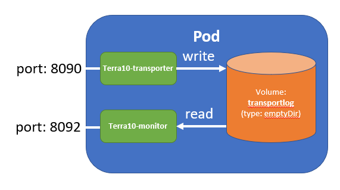

# 18. Volume emptyDir: data on disk

So far, all the stuff we have put into Pods was stateless. No data was needed for operation of the Pods, nor did the Pods persist data in whatever way. However, only a very small part of your application's functionality will work in this manner. Most applications require some form of storage.

This Lab is the first lab where we introduce you to Kubernetes Volumes: 

- a directory, possibly with some data in it
- accessible to the Containers in a Pod 
- is mounted into a Container
- is specified in the Pod specification, including where the Volume is mounted
- the lifetime is the same as the lifetime of the Pod
- as a consequence, data is preserved across Container re-starts 

A process in a Container sees a filesystem view composed from their Docker image and Volumes!

We will start with a simple Volume type: emptyDir. The emptyDir Volume type:

- is initially empty
- has files that can be read and written by all Containers in the Pod
- can be mounted at the same or different paths in each Container in the Pod
- data is lost forever when the Pod is removed

That last bullet implies that the emptyDir Volume can't be used to store data with a lifetime longer than a Pod. Hence, a typical use case for the emptyDir Volume is the exchange of data between Containers in the same Pod.

## 18.1 Example: Terra10 transporter

In this lab, we will establish the following set-up:



We will specify a Pod that consists of:

- Container terra10-transporter: the functionality to 'transport someone from one location to another'
- Container terra10-monitor: returns a log file of the activity of the transporter
- Volume transportlog: holds the log file for the transporter

You probably have already guessed that terra10-transporter writes logging data to the transportlog Volume. The terrra10-monitor retrieves the data from the transportlog Volume

## 18.2 Pod specification

The manifest file for the Pod, as well as the code for the 2 Docker Containers is in the `lab 18` folder.

The Pod manifest `terra10-transporter.yaml`:

```bash
apiVersion: v1
kind: Pod
metadata:
  name: terra10-transporter                # name of the Pod
spec:
  containers:
  - image: lgorissen/terra10-transporter   # 1st Container image
    name: terra10-transporter              # 1st name: terra10-transporter
    volumeMounts:                          # the volumes mounted in the Container
    - name: transportlog                   # the name of the mounted volume
      mountPath: /tmp                      # the volume mountpoint in the Container 
    ports:
    - containerPort: 8092                  # 1st Container exposed port
      protocol: TCP
  - image: lgorissen/terra10-monitor       # 2nd Container image
    name: terra10-monitor                  # 2nd name: terra10-monitor
    volumeMounts:                          # the volues mounted in the Container
    - name: transportlog                   # the name of the mounted volue
      mountPath: /var/log                  # the volume mountpoint in the Container
      readOnly: true                       # mounted as read-only
    ports:
    - containerPort: 8090                  # 2nd Container exposed port
      protocol: TCP
  volumes:                                 # Volume specification section
  - name: transportlog                     # 1st mounted volume name
    emptyDir: {}                           # volume type: emptyDir

```

## 18.3 Test with the Pod

Now, let's fire up the Pod:

```bash
developer@developer-VirtualBox:~/projects/k4d/lab 18$ kubectl create -f terra10-transporter.yaml 
pod/terra10-transporter created
developer@developer-VirtualBox:~/projects/k4d/lab 18$ kubectl describe pod terra10-transporter 
Name:         terra10-transporter
Namespace:    default
Node:         minikube/10.0.2.15
Start Time:   Tue, 16 Oct 2018 20:01:04 +0200
Labels:       <none>
Annotations:  <none>
Status:       Running
IP:           172.17.0.9
Containers:
  terra10-transporter:
    Container ID:   docker://b03a72af4429b9ae317011f78ce7adab4768468a622ad5ffe6aaafa6c952f836
    Image:          lgorissen/terra10-transporter
    Image ID:       docker-pullable://lgorissen/terra10-transporter@sha256:df80b324cf016afdfde25f40be57a4c7ca807111c40f5e7545a166606a8c5138
    Port:           8092/TCP
    Host Port:      0/TCP

...
```

Study the description of the Pod and have a look at the Volume description.

Now, test the Pod (use the Pod IP address from the description)(for you sceptical people out there: use your own names):

```bash
developer@developer-VirtualBox:~/projects/k4d/lab 18$ curl 'http://172.17.0.9:8090?name=Luc&from=DenBosch&to=Moon'
Hello, Luc will be transported from DenBosch to Moon using the Terra10 transporter service
developer@developer-VirtualBox:~/projects/k4d/lab 18$ curl 'http://172.17.0.9:8090?name=Harry&from=DenBosch&to=Moon'
Hello, Harry will be transported from DenBosch to Moon using the Terra10 transporter service
developer@developer-VirtualBox:~/projects/k4d/lab 18$ curl 'http://172.17.0.9:8092'
Luc is transported from DenBosch to Moon
Harry is transported from DenBosch to Moon
developer@developer-VirtualBox:~/projects/k4d/lab 18$ 
```

OK, so the emptyDir volume does exchange the data between the 2 Containers.


## 18.4 Container re-start

Now, the specification says that the emptyDir volume survives the Container re-starts. So, let's stop the 2 Containers in the Pod and see what happens.
Get the 2 Docker Container IDs from the Pod description and stop them:

```bash
developer@developer-VirtualBox:~/projects/k4d/lab 18$ kubectl describe pod terra10-transporter 
Name:         terra10-transporter
Namespace:    default
Node:         minikube/10.0.2.15
Start Time:   Tue, 16 Oct 2018 20:05:18 +0200
Labels:       <none>
Annotations:  <none>
Status:       Running
IP:           172.17.0.9
Containers:
  terra10-transporter:
    Container ID:   docker://4ce58b2de49489f4f1e14cff1081245c98b5b1af8a5fde76b4300e3a24adffff
    Image:          lgorissen/terra10-transporter
    Image ID:       docker-pullable://lgorissen/terra10-transporter@sha256:df80b324cf016afdfde25f40be57a4c7ca807111c40f5e7545a166606a8c5138
    Port:           8092/TCP
...
...
developer@developer-VirtualBox:~/projects/k4d/lab 18$ docker stop 4ce58
4ce58
developer@developer-VirtualBox:~/projects/k4d/lab 18$ docker stop 29128
29128
developer@developer-VirtualBox:~/projects/k4d/lab 18$ curl 'http://172.17.0.9:8092'
Luc is transported from DenBosch to Moon
Harry is transported from DenBosch to Moon
developer@developer-VirtualBox:~/projects/k4d/lab 18$
```

We see that the Kubernetes Pod has re-started the Containers and that the data is pre-served in the emptyDir Volume!

Clean up!
