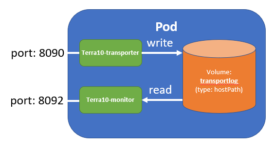

# 19. Volume hostPath: Worker Node file system

The previous lab covered the *emptyDir* Volume type. Kubernetes knows a lot of different Volume types. They can be clustered in some categories:

| Volume type  | Description                                                     | Lab   |
|--------------|-----------------------------------------------------------------|-------|
|emptyDir      | Attached to a Pod, initially empty, deleted when Pod is deleted | 18    |
|hostPath      | Local on the Worker Node                                        | 19    |
|gitRepo       | Volume initializes with the contact of a Git repository         | 20    |
|network storages | nfs, cinder, cephfs, iscsi, flocker, glusterfs, quobyte, rbd, flexVolume, vsphere-Volume, photonPersistentDisk, scaleIO | - |
| Cloud storage | gcePersistentDisk (Google Compute Engine Persistent Disk), awsElastic-BlockStore (Amazon Web Services Elastic Block Store Volume), azureDisk (Microsoft Azure Disk Volume) | - |
| configMap    | inject configuration data into a Pod                            | 21, 22    | 
| secret       | inject sensitive configuration data into a Pod                  | 23    |
| downwardAPI  | makes downward API data available in plain text files           | 24    |
| persistentVolumeClaim | claim durable storage without knowing the implementation details | 25 |


Note:

- which of the above volume types are supported in your Kubernetes set-up may depend on your provider
- we will not shown examples of the network and Cloud storage providers as those may not be readily available in your set-up. However, when your have completed the other labs on Volumes, you should be able to figure out the details on any specific Volume type by yourself ;-)

Depending on your Kubernetes provider, some volume types may not be supported: when you set up your Kubernetes platform, slecting the Storage is one of the big topics!

## 19.1 hostPath volumes

The *hostPath* volume mounts a file or directory from the Worker (host) Node’s filesystem into your Pod. This is a solution that you have to think through carefully: is will make the data for your Pod dependending on the Worker Node that the Pod is running on. That is something that for most Pods your don't want!
However, it may be a viable use case in some situations, e.g. with DaemonSets.

In this lab, we will replace the *emptyDir* volume of lab 18 with a *hostPath* volume:



The manifest file `terra10-transporter-hostpath.yaml` is pretty much the same as in the previous lab. Only the volume definition had to be changed! (well, I also changed the name of the volumeMount for clarity - but that wasn't necessary!):

```bash
apiVersion: v1
kind: Pod
metadata:
  name: terra10-transporter-hostpath
spec:
  containers:
  - image: lgorissen/terra10-transporter
    name: terra10-transporter
    volumeMounts:
    - name: transportlog-hostpath      # volume name
      mountPath: /tmp
    ports:
    - containerPort: 8092
      protocol: TCP
  - image: lgorissen/terra10-monitor
    name: terra10-monitor
    volumeMounts:
    - name: transportlog-hostpath      # volume name
      mountPath: /var/log
      readOnly: true
    ports:
    - containerPort: 8090
      protocol: TCP
  volumes:
  - name: transportlog-hostpath        # volume name
    hostPath:                          # hostPath Volume
      path: /tmp/terra10-transporter   # path on the Worker Node where the Volume is mounted
```

Let's get this to work. Create the directory and post the manifest file:

```bash
developer@developer-VirtualBox:~/projects/k4d/lab 19$ mkdir /tmp/terra10-transporter
developer@developer-VirtualBox:~/projects/k4d/lab 19$ kubectl create -f terra10-transporter-hostpath.yaml 
pod/terra10-transporter-hostpath created
developer@developer-VirtualBox:~/projects/k4d/lab 19$ kubectl get pod terra10-transporter-hostpath 
NAME                           READY     STATUS    RESTARTS   AGE
terra10-transporter-hostpath   2/2       Running   0          11s
developer@developer-VirtualBox:~/projects/k4d/lab 19$
```
Find the IP address of the Pod:

```bash
developer@developer-VirtualBox:~/projects/k4d/lab 19$ kubectl describe pod terra10-transporter-hostpath 
Name:         terra10-transporter-hostpath
Namespace:    default
Node:         minikube/10.0.2.15
Start Time:   Fri, 19 Oct 2018 11:38:42 +0200
Labels:       <none>
Annotations:  <none>
Status:       Running
IP:           172.17.0.4
Containers:
  terra10-transporter:
    Container ID:   docker://16a498a0608ffd473fd74f7c8a9b7b490918330a76d7e409bd38dd403944ebd8
    Image:          lgor
```
    
Test by transporting some people and then have a look at what's happening in the `/tmp/terra10-transporter` directory:

```bash
developer@developer-VirtualBox:~/projects/k4d/lab 19$ curl 'http://172.17.0.4:8090?name=Luc&from=DenBosch&to=Moon'
Hello, Luc will be transported from DenBosch to Moon using the Terra10 transporter service
developer@developer-VirtualBox:~/projects/k4d/lab 19$ curl 'http://172.17.0.4:8090?name=Elvis&from=DenBosch&to=Moon'
Hello, Elvis will be transported from DenBosch to Moon using the Terra10 transporter service
developer@developer-VirtualBox:~/projects/k4d/lab 19$ curl 'http://172.17.0.4:8092'
Luc is transported from DenBosch to Moon
Elvis is transported from DenBosch to Moon
developer@developer-VirtualBox:~/projects/k4d/lab 19$ more /tmp/terra10-transporter/transporter.log 
Luc is transported from DenBosch to Moon
Elvis is transported from DenBosch to Moon
developer@developer-VirtualBox:~/projects/k4d/lab 19$
```

## 19.2 Is it persistent?

The claim is that the hostVolume - as opposed to the emptyDir Volume - will not be delete when the Pod is deleted / re-started.

Proof of the pudding:

- delete existing Pod
- check if the transporter log file is still there: `/tmp/terra10-transporter/transporter.log`
- create the Pod
- get the IP address of the new Pod
- transport Kurt Cobain to the Moon
- check if Kurt has arrived
- ... party can start


```bash
developer@developer-VirtualBox:~/projects/k4d/lab 19$ kubectl delete pod terra10-transporter-hostpath 
pod "terra10-transporter-hostpath" deleted
developer@developer-VirtualBox:~/projects/k4d/lab 19$ more /tmp/terra10-transporter/transporter.log 
Luc is transported from DenBosch to Moon
Elvis is transported from DenBosch to Moon
developer@developer-VirtualBox:~/projects/k4d/lab 19$ kubectl create -f terra10-transporter-hostpath.yaml 
pod/terra10-transporter-hostpath created
developer@developer-VirtualBox:~/projects/k4d/lab 19$ kubectl describe pod terra10-transporter-hostpath 
Name:         terra10-transporter-hostpath
Namespace:    default
Node:         minikube/10.0.2.15
Start Time:   Fri, 19 Oct 2018 11:48:16 +0200
Labels:       <none>
Annotations:  <none>
Status:       Running
IP:           172.17.0.4
Containers:
  terra10-transporter:
...
...
developer@developer-VirtualBox:~/projects/k4d/lab 19$ curl 'http://172.17.0.4:8090?name=KurtCobain&from=DenBosch&to=Moon'
Hello, KurtCobain will be transported from DenBosch to Moon using the Terra10 transporter service
developer@developer-VirtualBox:~/projects/k4d/lab 19$ curl 'http://172.17.0.4:8092'
Luc is transported from DenBosch to Moon
Elvis is transported from DenBosch to Moon
KurtCobain is transported from DenBosch to Moon
developer@developer-VirtualBox:~/projects/k4d/lab 19$ more /tmp/terra10-transporter/transporter.log 
Luc is transported from DenBosch to Moon
Elvis is transported from DenBosch to Moon
KurtCobain is transported from DenBosch to Moon
developer@developer-VirtualBox:~/projects/k4d/lab 19$ 
```

That's it. Clean up!
