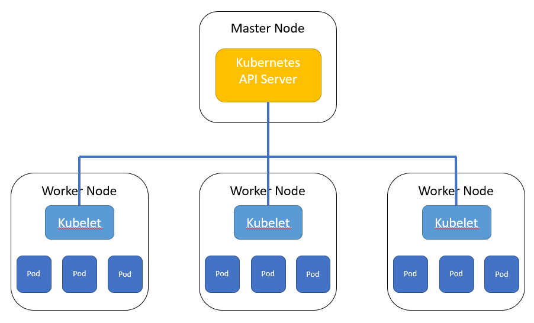
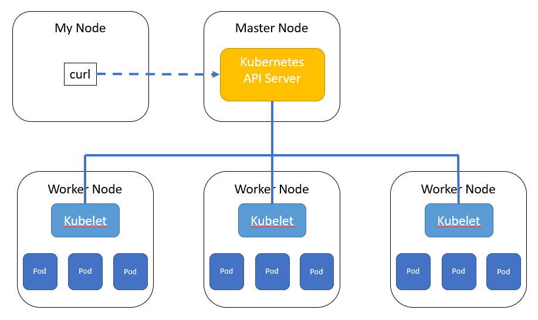
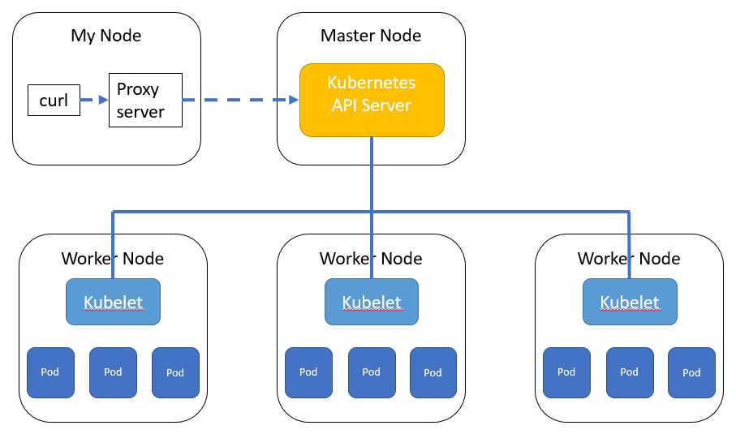

# 27. Kubernetes API Server: access via kubectl proxy

The DownwardAPI volume provides access to some metadata of a Pod and its Containers. But sometimes you will want to more. Then, you have talk directly to the Kubernetes API Server!

In this and the next couple of labs, we will show several ways to access the Kubernetes API Server:

- **lab 27:** Use *curl and the kubectl proxy*
- **lab 28:** Use *curl - from within a Pod*
- **lab 29:** Use *curl - and a sidecar Container*
- **lab 30:** Use *client libraries*

All-in-all, that should give you enough tools to handle your requirements.

This lab will explore the Kubernetes API, using curl and the kubectl proxy.

## 27.1 Curl and the kubectl proxy

The Kubernetes API Server is running on the Master Node. From there, the Kubernetes API Server handles the communication with the Kubelets on the Worker Nodes:




## 27.2 Curl to the Kubernetes API Server

So, let's try to directly access the Kubernetes API Server using curl... in the minikube set-up. Here, you run the curl command on the Master Node itself:




```bash
developer@developer-VirtualBox:~/projects/k4d/lab 27$ kubectl cluster-info
Kubernetes master is running at https://10.0.2.15:8443
CoreDNS is running at https://10.0.2.15:8443/api/v1/namespaces/kube-system/services/kube-dns:dns/proxy

To further debug and diagnose cluster problems, use 'kubectl cluster-info dump'.
developer@developer-VirtualBox:~/projects/k4d/lab 27$ curl https://10.0.2.15:8443/api/
curl: (60) SSL certificate problem: unable to get local issuer certificate
More details here: https://curl.haxx.se/docs/sslcerts.html

curl failed to verify the legitimacy of the server and therefore could not
establish a secure connection to it. To learn more about this situation and
how to fix it, please visit the web page mentioned above.
developer@developer-VirtualBox:~/projects/k4d/lab 27$
```

Now, that didn't work: the clients certificate was missing, and therefore curl can't establish a safe connection. We're lazy and use the unsafe -k option (= insecure):

```bash

developer@developer-VirtualBox:~/projects/k4d/lab 27$ curl -k https://10.0.2.15:8443/api/
{
  "kind": "APIVersions",
  "versions": [
    "v1"
  ],
  "serverAddressByClientCIDRs": [
    {
      "clientCIDR": "0.0.0.0/0",
      "serverAddress": "10.0.2.15:8443"
    }
  ]
developer@developer-VirtualBox:~/projects/k4d/lab 27$ 
```

Above:

- we used the curl option `-k` to skip the authorization
- we got a response because we were running curl on the Master Node

Running the above curl command from another host would have given a result like shown below:

```bash
user@another-machine:~$ curl -k https://10.0.2.15:8443/api/
Unauthorized
user@another-machine:~$ 
```
So, you have to deal with the authentication yourself, or ...

## 27.3 Curl to the Kubernetes API Server - via a proxy server

An easy alternative is to run a proxy server on your machine using kubectl. Note that kubectl must be configured to communicate with your cluster: https://kubernetes.io/docs/tasks/tools/install-kubectl/#configure-kubectl



As we assume you have a minikube set-up, you can skip configuration. Run the proxy server in the background and then access the Kubernetes API Server through the proxy:

```bash
developer@developer-VirtualBox:~/projects/k4d/lab 27$ kubectl proxy --port=8080 &
[1] 30460
developer@developer-VirtualBox:~/projects/k4d/lab 27$ Starting to serve on 127.0.0.1:8080

developer@developer-VirtualBox:~/projects/k4d/lab 27$ curl localhost:8080/api
{
  "kind": "APIVersions",
  "versions": [
    "v1"
  ],
  "serverAddressByClientCIDRs": [
    {
      "clientCIDR": "0.0.0.0/0",
      "serverAddress": "10.0.2.15:8443"
    }
  ]
}developer@developer-VirtualBox:~/projects/k4d/lab 27$
```

Keep the proxy server running, and export the API Server's API:


**get a list of Pods**

Get a list of Pods:

```bash
developer@developer-VirtualBox:~/projects/k4d/lab 27$ curl http://localhost:8080/api/v1/pods
{
  "kind": "PodList",
  "apiVersion": "v1",
  "metadata": {
    "selfLink": "/api/v1/pods",
    "resourceVersion": "223448"
  },
  "items": [
    {
      "metadata": {
        "name": "terra10-gitrepo",
        "namespace": "default",
        "selfLink": "/api/v1/namespaces/default/pods/terra10-gitrepo",
        "uid": "7f8f682f-d3a2-11e8-b8b0-0800276251a2",
        "resourceVersion": "214239",
        "creationTimestamp": "2018-10-19T13:25:51Z"
      },
      "spec": {
        "volumes": [
          {
            "name": "terra10-git-volume",
            "gitRepo": {
              "repository": "https://github.com/lgorissen/k4d.git",
              "revision": "42ee9a72a82e35aa017a132c9b553ad79c05421e"
            }
          },
          {
            "name": "default-token-7sddz",
            "secret": {
...
```
**get a specific ReplicaSet**

Get a specific ReplicaSet:

```bash
developer@developer-VirtualBox:~/projects/k4d/lab 27$ kubectl get rs
NAME         DESIRED   CURRENT   READY     AGE
terra10-rs   3         3         3         26d
developer@developer-VirtualBox:~/projects/k4d/lab 27$ curl http://localhost:8080/apis/apps/v1/namespaces/default/replicasets/terra10-rs
{
  "kind": "ReplicaSet",
  "apiVersion": "apps/v1",
  "metadata": {
    "name": "terra10-rs",
    "namespace": "default",
    "selfLink": "/apis/apps/v1/namespaces/default/replicasets/terra10-rs",
    "uid": "6b21d569-cfc2-11e8-91cb-0800276251a2",
    "resourceVersion": "178343",
    "generation": 1,
    "creationTimestamp": "2018-10-14T15:04:16Z",
    "labels": {
      "app": "terra10"
    }
  },
  "spec": {
    "replicas": 3,
    "selector": {
      "matchExpressions": [
        {
          "key": "app",
          "operator": "In",
          "values": [
            "terra10"
          ]
        }
      ]
    },
    "template": {
      "metadata": {
        "creationTimestamp": null,
        "labels": {
          "app": "terra10"
        }
      },
      "spec": {
        "containers": [
          {
            "name": "terra10",
            "image": "lgorissen/terra10",
            "resources": {
              
            },
            "terminationMessagePath": "/dev/termination-log",
            "terminationMessagePolicy": "File",
            "imagePullPolicy": "Always"
          }
        ],
        "restartPolicy": "Always",
        "terminationGracePeriodSeconds": 30,
        "dnsPolicy": "ClusterFirst",
        "securityContext": {
          
        },
        "schedulerName": "default-scheduler"
      }
    }
  },
  "status": {
    "replicas": 3,
    "fullyLabeledReplicas": 3,
    "readyReplicas": 3,
    "availableReplicas": 3,
    "observedGeneration": 1
  }
}developer@developer-VirtualBox:~/projects/k4d/lab 27$
```

**get the Swagger definition**

Get the Swagger definition:

```bash
developer@developer-VirtualBox:~/projects/k4d/lab 27$ curl http://localhost:8080/swagger.json | more
  % Total    % Received % Xferd  Average Speed   Time    Time     Time  Current
                                 Dload  Upload   Total   Spent    Left  Speed
  0     0    0     0    0     0      0      0 --:--:-- --:--:-- --:--:--     0{
  "swagger": "2.0",
  "info": {
   "title": "Kubernetes",
   "version": "v1.10.0"
  },
  "paths": {
   "/api/": {
...
    "description": "Bearer Token authentication",
    "type": "apiKey",
    "name": "authorization",
    "in": "header"
   }
  },
  "security": [
   {
    "BearerToken": []
   }
  ]
 }developer@developer-VirtualBox:~/projects/k4d/lab 27$
 ```
 
 That's a long one ;-)
 
 
