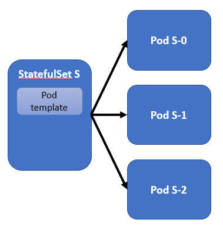
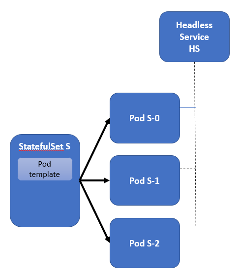
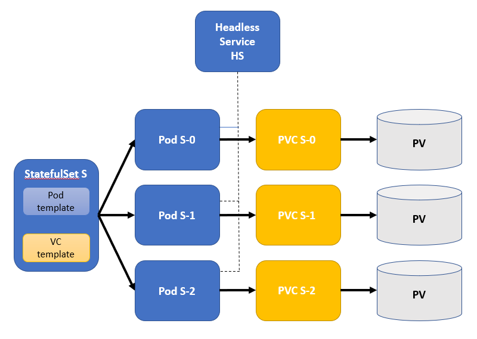

# 35. StatefulSet: handling stateful applications


So far, our Pods didn't have state: they were stateless. So the ReplicationController or ReplicaSet starts several Pods of the same type, and the incoming requests can be processed by any one of them. Quite convenient. As much as we don't like it, your application may require a request to be processed by a specific Pod. The Pod has become stateful. 

## Stateful Pods 

A stateful Pod requires that:

1. the request can be routed to the right Pod,
2. the Pod has access to its own, dedicated storage.

Both requirements can't be met with the Kubernetes objects we have covered so far:

- the Service can't route requests to a specific Pod
- a re-start of the Pod can't guarantee that it will get the same storage

There are work arounds to handle this, think along the lines of layering multiple Services, and let Pods share a PVC, but use 'a free' directory within that PV. But these work arounds are complicated and therefore error-prone.

We need a different solution for statefull Pods ...


## StatefulSets

Kubernetes offers the StatefullSet object to manage stateful applications. The StatefulSet, unlike the Deployment, gives the Pods a persistent identifier. That identifier is maintained, also across re-scheduling for e.g. failures, upgrades and up/down scaling. 

StatefulSets have the following properties - as per Kubernetes reference documentation:

- Stable, unique network identifiers.
- Stable, persistent storage.
- Ordered, graceful deployment and scaling.
- Ordered, automated rolling updates.

This should be enough to handle your stateless applications. 

The next sections will describe StatefulSets, step-by-step. The above mentioned properties will then become clear.

### Stable, unique network identifiers

A StatefulSet, just like a ReplicaSet, creates a number of Pods from the Pod template that is part of its definition. With a ReplicaSet, the Pod get rondom names. With the StatefulSet on the other hand, the Pod names are assigned as *<StatefulSet-name> + '-' + <index>*.

In the figure below, there is a StatefulSet named *S*, and 3 Pods that have names *S-0*, *S-1* and *S-2*:



This results in Pods having a predictable hostname, in our case *S-0*, *S-1* and *S-2*. However, that is not enough! It must be possible for clients to address a specific Pod. Unlike the stateless Pods, where a LoadBalancer Service distrubutes requests over all available Pods, the statefull application has different requirements: the client must be able to address a specific Pod.

For these requirements the Headless Service can be used. This Service controls the domain of the Pods, and is also known as the *governing service*:



All Pods will then have their own DNS entry. Our example is illustrated with the table below for Pod S-0. Assume that all values indicate that all objects are in namespace *default*:

| name               | value                            |
|--------------------|----------------------------------|
| Cluster domain     | cluster.local                    |
| Headless Service   | default/HS                       |
| StatefulSet        | default/S                        |
| StatefulSet domain | HS.default.svc.cluster.local     |
| Pod DNS            | S-0.HS.default.svc.cluster.local |
| Pod hostname       | S-0                              |

With all these Pod DNS records available, a client can address Pods directly.

### Stable, persistent storage

Next step is to add storage to the Pods. The StatefulSet definition can also have Volume Claim Templates that define how/what Persistent Volume Claims the Pods will do:



For each VolumeClaimTemplate, Kubernetes creates for each Pods a Persistent Volume Claim and the corresponding Persistent Volume.

### Ordered, graceful deployment and scaling

**Deployment**

When a StatefulSet is created:

- Pods are deployed in order 0, ..., N-1 (with N the size of the set)
- Pods are deleted in order N-1, ..., 0
- Pod scaling on Pod M is only executed when all Pods 0, ..., M-1 are Running and Ready
- Pod termination of Pod M is only done when all Pods M+1, ..., N-1 are completely shutdown

The above set of rules ensures that deployment and scaling operations are only executed on well-defined, stable situations.

**Scaling**

With respect to scaling, it is important to understand what happens with Pods and their storage. When the size of a StatefulSet is decreased, scale down, the N-1 Pod is deleted:


Note that the corresponding storage remains in place.
Now, when scaling up again, the new Pod will (re-)use the still present storage:

That behaviour around storage, together with assigning the same Pod (DNS) names, gives a predictable, stable network and storage experience.


**Recovery**

The above behavior also applies in case of recovery from Pod failures. When e.g. the Worker Node crashes that runs Pod S-1, this Pod will be re-created on another Worker Node:

- with the same name, and
- with the same storage


### Ordered, automated rolling updates

StatefulSets support 2 update strategies

**1. On Delete**

The 'On Delete' update is done in the following steps:

- update the StatefulSet's specification
- delete Pods manually, to make the controller create new Pods according to the updated specification

**2. Rolling Updates**

The (default) RollingUpdate update strategy implements automated, rolling Pods update. The controller will:

- update the Pods in order N-1, N-2, ... , 0 
- update one Pod at a time
- wait for an updated Pod to be Running and Ready, before continuing to update the next Pod

For further details on updates, like e.g. Partitions, please refer to the Kubernetes reference documentation: https://kubernetes.io/docs/concepts/workloads/controllers/statefulset/#update-strategies


## StatefulSets - example set-up


So far, a lot of theory. Now it's time to get to work. We will create an example based on the set-up in Lab 19:


We will re-structure this set-up into a configuration of multiple transporters that write their data into a log file. We will change the Container slightly: it will write the Pod's hostname into the log file... The code - as well as all the other files -  is available in the `lab 35` directory.

The Container images are available in Docker Hub: `lgorissen/terra10-transporter:podname` and `lgorissen-terra10-monitor:latest`.

The set-up we will make is shown below:


The above set-up will be created in 2 steps:

- Create the Headless Service *terra10-hs* (defined in `terra10-service-headless.yaml`)
- Create the StatefulSet *terra10* (defined in `terra10-statefulset.yaml`)

We will first only create the set-up. Some tests will be done in a separate section.


## StatefulSets - create Headless Service *terra10-hs*

Note that Kubernetes requires the Service that governs the StatefulSet to be present before the StatefulSet itself is created!

The manifest file `terra10-service-headless.yaml` looks like:

```bash
apiVersion: v1
kind: Service                   # objec type: Service
metadata:
  name: terra10-hs              # service name
spec:
  clusterIP: None               # making it a Headless service
  selector:
    app: terra10                # Pod selector
  ports:                        # accessible ports:
  - name: http-transporter
    port: 8090
    targetPort: 8090
  - name: http-monitor
    port: 8092
    targetPort: 8092
```

Create the Headless Service:

```bash
developer@developer-VirtualBox:~/projects/k4d/lab 35$ k create -f terra10-service-headless.yaml 
service/terra10-hs created
developer@developer-VirtualBox:~/projects/k4d/lab 35$ k get service terra10-hs 
NAME         TYPE        CLUSTER-IP   EXTERNAL-IP   PORT(S)             AGE
terra10-hs   ClusterIP   None         <none>        8090/TCP,8092/TCP   7s
developer@developer-VirtualBox:~/projects/k4d/lab 35$ 
```

OK.


## StatefulSets - create StatefulSet *terra10*

The manifest file `terra10-statefulset.yaml` looks like:

```bash
apiVersion: apps/v1beta1
kind: StatefulSet                         # object type: StatefulSet
metadata:
  name: terra10                           # StatefulSet name
spec:                                     # spec of StatefulSet
  serviceName: terra10-hs                 # service that governs this StatefulSet
  replicas: 2                             # we want 2 Pods
  template:                               # Start of the Pod template
    metadata:
      labels:
        app: terra10                      # Pod label, for use by Headless Service
    spec:
      containers:
      - image: lgorissen/terra10-transporter:podname  # first Container in Pod
        name: terra10-transporter         # name
        volumeMounts:                     # volume used
        - name: transportlog
          mountPath: /tmp
        ports:                            # port exposed
        - containerPort: 8092
          protocol: TCP
      - image: lgorissen/terra10-monitor  # second Container in Pod
        name: terra10-monitor             # name
        volumeMounts:                     # volume used
        - name: transportlog
          mountPath: /var/log
          readOnly: true
        ports:                            # port exposed
        - containerPort: 8090
          protocol: TCP
  volumeClaimTemplates:                   # list of Volume Claims that Pods can refer to
  - metadata:
      name: transportlog                  # name Volume Claim
    spec:                                 # use dynamic provisioning
      resources:
        requests:
          storage: 1Mi
      accessModes:
      - ReadWriteOnce  
      storageClassName: standard          # name of the StorageClass that is to be used
```

Create the StatefulSet and verify that all expected components are there:

```bash
developer@developer-VirtualBox:~/projects/k4d/lab 35$ k create -f terra10-statefulset.yaml 
statefulset.apps/terra10 created
developer@developer-VirtualBox:~/projects/k4d/lab 35$ k get statefulset
NAME      DESIRED   CURRENT   AGE
terra10   2         2         8s
developer@developer-VirtualBox:~/projects/k4d/lab 35$ k get pod
NAME        READY     STATUS    RESTARTS   AGE
terra10-0   2/2       Running   0          16s
terra10-1   2/2       Running   0          11s
developer@developer-VirtualBox:~/projects/k4d/lab 35$ k get pvc
NAME                     STATUS    VOLUME                                     CAPACITY   ACCESS MODES   STORAGECLASS   AGE
transportlog-terra10-0   Bound     pvc-d5db8547-eb5f-11e8-ada0-0800276251a2   1Mi        RWO            standard       21s
transportlog-terra10-1   Bound     pvc-d8a36fe1-eb5f-11e8-ada0-0800276251a2   1Mi        RWO            standard       16s
developer@developer-VirtualBox:~/projects/k4d/lab 35$ k get pv
NAME                                       CAPACITY   ACCESS MODES   RECLAIM POLICY   STATUS    CLAIM                            STORAGECLASS   REASON    AGE
pvc-d5db8547-eb5f-11e8-ada0-0800276251a2   1Mi        RWO            Delete           Bound     default/transportlog-terra10-0   standard                 26s
pvc-d8a36fe1-eb5f-11e8-ada0-0800276251a2   1Mi        RWO            Delete           Bound     default/transportlog-terra10-1   standard                 21s
developer@developer-VirtualBox:~/projects/k4d/lab 35$
```

By now, we have created our example set-up:


## StatefulSets - tests!

Now it is time to start testing.

**Does Pod terra10-0 work?**

The Pod has 2 Containers. One for transporting someone and one for checking the transporter log. Let's check if Pod *terra10-0* works:

```bash
developer@developer-VirtualBox:~/projects/k4d/lab 35$ k describe pod terra10-0 | grep "^IP" 
IP:             172.17.0.5
developer@developer-VirtualBox:~/projects/k4d/lab 35$ curl 'http://172.17.0.5:8090?name=Luc&from=DenBosch&to=Mars' 
Hello, on terra10-0, Luc will be transported from DenBosch to Mars using the Terra10 transporter service
developer@developer-VirtualBox:~/projects/k4d/lab 35$ curl http://172.17.0.5:8092
transporter terra10-0 has transporteed Luc is transported from DenBosch to Mars
developer@developer-VirtualBox:~/projects/k4d/lab 35$ 
```
Note how the log line indicates the Pod name `terra10-0`.

Now that Luc is on Mars, just send along some other people so they can mingle:

```bash
developer@developer-VirtualBox:~/projects/k4d/lab 35$ curl 'http://172.17.0.5:8090?name=Elvis&from=Maaskantje&to=Mars' 
Hello, on terra10-0, Elvis will be transported from Maaskantje to Mars using the Terra10 transporter service
developer@developer-VirtualBox:~/projects/k4d/lab 35$ curl 'http://172.17.0.5:8090?name=AlCapone&from=NewYork&to=Mars' 
Hello, on terra10-0, AlCapone will be transported from NewYork to Mars using the Terra10 transporter service
developer@developer-VirtualBox:~/projects/k4d/lab 35$ curl http://172.17.0.5:8092
transporter terra10-0 has transporteed Luc is transported from DenBosch to Mars
transporter terra10-0 has transporteed Elvis is transported from Maaskantje to Mars
transporter terra10-0 has transporteed AlCapone is transported from NewYork to Mars
developer@developer-VirtualBox:~/projects/k4d/lab 35$
```
**Does Pod terra10-1 work?**

So far, nothing has happened in Pod terra10-1. Let's verify that:

```bash
developer@developer-VirtualBox:~/projects/k4d/lab 35$ k describe pod terra10-1 | grep "^IP" 
IP:             172.17.0.6
developer@developer-VirtualBox:~/projects/k4d/lab 35$ curl http://172.17.0.6:8092
developer@developer-VirtualBox:~/projects/k4d/lab 35$ 
```

(... or you will get a *no file found* error)

Now, let's use the terra10-1 transporter and check the log files for both Pods:

```bash
developer@developer-VirtualBox:~/projects/k4d/lab 35$ curl 'http://172.17.0.6:8090?name=Napoleon&from=Elba&to=Mars' 
Hello, on terra10-1, Napoleon will be transported from Elba to Mars using the Terra10 transporter service
developer@developer-VirtualBox:~/projects/k4d/lab 35$ curl http://172.17.0.6:8092
transporter terra10-1 has transporteed Napoleon is transported from Elba to Mars
developer@developer-VirtualBox:~/projects/k4d/lab 35$ curl http://172.17.0.5:8092
transporter terra10-0 has transporteed Luc is transported from DenBosch to Mars
transporter terra10-0 has transporteed Elvis is transported from Maaskantje to Mars
transporter terra10-0 has transporteed AlCapone is transported from NewYork to Mars
developer@developer-VirtualBox:~/projects/k4d/lab 35$ 
```
So, both Pods have their own storage, and they don't mix. That's good!

**Delete Pod terra10-1 by scaling down**

We will scale down to delete Pod *terra10-1*. Edit the StatefulSet and change the number for Replicas to **1**:

```bash
developer@developer-VirtualBox:~/projects/k4d/lab 35$ k edit statefulset terra10 
statefulset.apps/terra10 edited
developer@developer-VirtualBox:~/projects/k4d/lab 35$ k get pod
NAME        READY     STATUS        RESTARTS   AGE
terra10-0   2/2       Running       0          11m
terra10-1   2/2       Terminating   0          11m
developer@developer-VirtualBox:~/projects/k4d/lab 35$ 
```
Note that the Pod **terra10-1** is being terminated and after some time:

```bash
developer@developer-VirtualBox:~/projects/k4d/lab 35$ k get pod
NAME        READY     STATUS    RESTARTS   AGE
terra10-0   2/2       Running   0          12m
developer@developer-VirtualBox:~/projects/k4d/lab 35$ 
```

Pod *terra10-0* should still be there, and Pod *terra10-1* should not respond:

```bash
developer@developer-VirtualBox:~/projects/k4d/lab 35$ curl http://172.17.0.5:8092
transporter terra10-0 has transporteed Luc is transported from DenBosch to Mars
transporter terra10-0 has transporteed Elvis is transported from Maaskantje to Mars
transporter terra10-0 has transporteed AlCapone is transported from NewYork to Mars
developer@developer-VirtualBox:~/projects/k4d/lab 35$ curl http://172.17.0.6:8092
curl: (7) Failed to connect to 172.17.0.6 port 8092: No route to host
developer@developer-VirtualBox:~/projects/k4d/lab 35$ 
```

Makes you wonder what Napoleon did to the transporter ;-)

**Add Pod terra10-1 by scaling up**

We will scale up to add Pod *terra10-1*. Edit the StatefulSet and change the number for Replicas to **2**:

```bash
developer@developer-VirtualBox:~/projects/k4d/lab 35$ k edit statefulset terra10 
statefulset.apps/terra10 edited
developer@developer-VirtualBox:~/projects/k4d/lab 35$ k get pod
NAME        READY     STATUS    RESTARTS   AGE
terra10-0   2/2       Running   0          17m
terra10-1   2/2       Running   0          5s
developer@developer-VirtualBox:~/projects/k4d/lab 35$ 
```

And the Pod is back. Now, we only need to verify whether the Pod got back its original storage. Remember: the file with Napoleon in it:

```bash
developer@developer-VirtualBox:~/projects/k4d/lab 35$ curl http://172.17.0.6:8092
transporter terra10-1 has transporteed Napoleon is transported from Elba to Mars
developer@developer-VirtualBox:~/projects/k4d/lab 35$ 
```

## Headless Service - tests!

The Headless Service promised to deliver DNS records for all Pods.

In tabular format, we expect our situation to be:

| name               | value                            |
|--------------------|----------------------------------|
| Cluster domain     | cluster.local                    |
| Headless Service   | default/terra10-hs                       |
| StatefulSet        | default/terra10                        |
| StatefulSet domain | terra10-hs.default.svc.cluster.local     |
| Pod hostname       | terra10-0                              |
| Pod DNS            | terra10-0.terra10-hs.default.svc.cluster.local |
| Pod hostname       | terra10-1                              |
| Pod DNS            | terra10-1.terra10-hs.default.svc.cluster.local |

To test this [lgo: show how to retrieve the DNS records]


Clean up!
